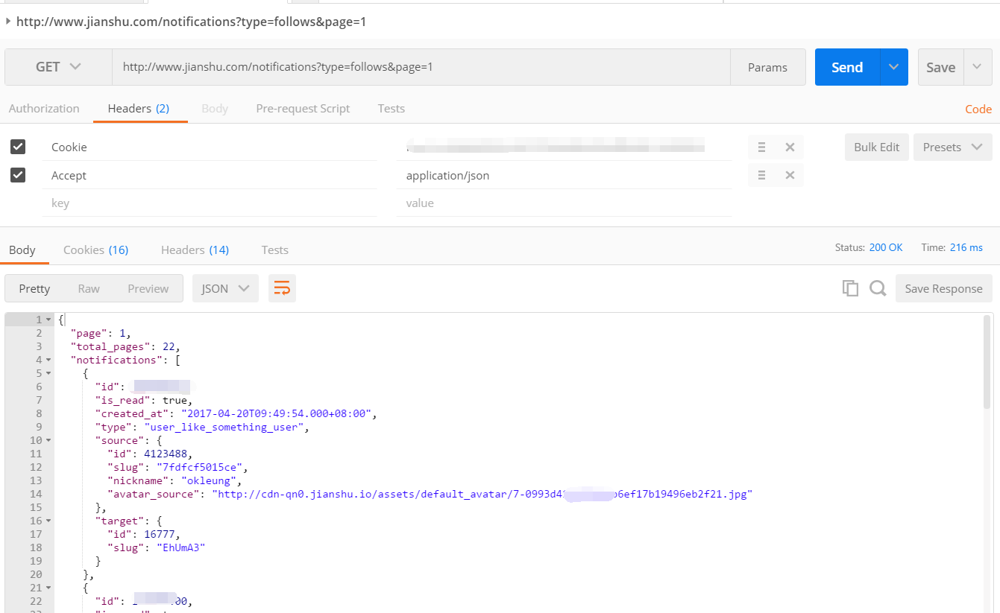

# 简书工具
简书是一个很好的写作的平台。但有些功能并不是很好用。于是有了做个让自己用的很爽工具的念头。

先用 Postman 测试了下，在带上登录后的 cookie 和设置合适的请求头后，就可以拿登录者相关数据了。如下图

## 功能
### 文章备份
[实现](artcile-backup)。 用 Puppteer 来做的。

### 登录
输入登录后的 cookie 。实现登录。 或者用 Puppteer。

### 给专题投稿的功能
列出用户的文章。和按照类型分类的专题。选文章，来投稿。 [实现](bin/submit-article.js)

### 统计类功能
* 粉丝每天新增的图。
* 列出所有的粉丝。带一些筛选条件。
